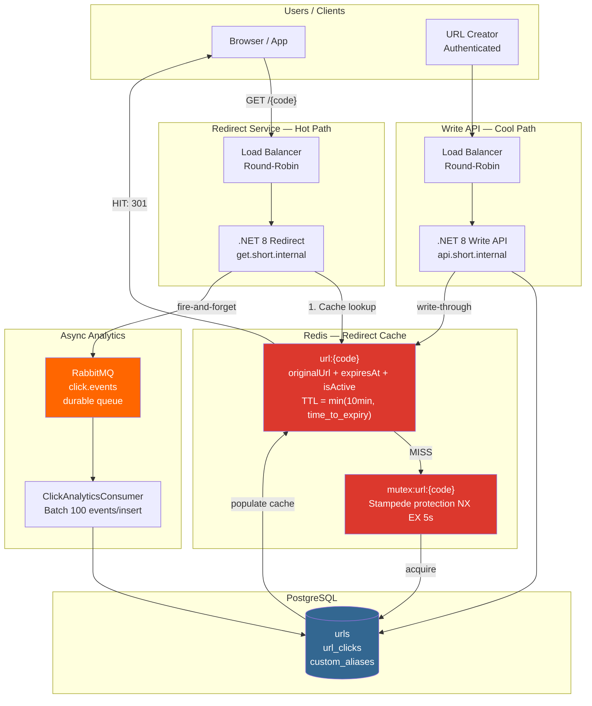

# URL Shortener Service

A high-throughput URL shortening service built with .NET 8, Redis caching with stampede protection, and async click analytics via RabbitMQ. Handles millions of redirects with sub-5ms p99 latency on cache hits.

---

## Quick Start

```bash
git clone <repo>
cd url-shortener-system
cp .env.example .env
docker compose up --build
```

- **API:** http://localhost:8085
- **Swagger:** http://localhost:8085/swagger
- **RabbitMQ UI:** http://localhost:15673 (devuser / devpass)

---

## Architecture



---

## Why I Built This

The URL shortener looks simple on the surface — map a short code to a long URL. The interesting engineering is in the non-functional requirements: a viral link can receive millions of hits within seconds, the p99 redirect latency must be sub-10ms, and click analytics must not slow down the redirect path. These three constraints together force the architecture: Redis caching, stampede protection for viral links, and fire-and-forget analytics via RabbitMQ.

---

## Key Design Decisions

**1. Cache TTL = min(10 minutes, time until URL expiry).** If a URL expires at T, and the cache entry has a 10-minute TTL populated at T-5, it would serve the URL for 5 minutes after expiry. The TTL is capped at the remaining time until expiry — a cache entry can never outlive the URL it represents.

**2. Stampede protection for viral links.** When a viral URL's cache entry expires, thousands of concurrent requests experience a cache miss simultaneously and would all query PostgreSQL. Redis SET NX acquires a 5-second exclusive rebuild lock — only one caller queries the DB and populates the cache, while others wait 30ms and read the freshly populated cache.

**3. Redirect and Write are separate deployable units.** Redirect traffic is orders of magnitude higher than write traffic. Separating them allows independent scaling: 50 redirect instances and 2 write instances. A deploy of the Write API has zero impact on redirect latency.

**4. Click analytics are fire-and-forget via RabbitMQ.** The redirect response is returned to the user before the click event is enqueued. A RabbitMQ consumer batch-inserts 100 events per PostgreSQL write, converting 1,200 redirects/second into 12 database writes/second.

**5. Custom alias race condition handled at DB constraint.** `custom_aliases.alias` is the PRIMARY KEY — inherently unique. The application checks for conflicts first, but the DB constraint is the authoritative guard against concurrent registrations of the same alias.

---

## What I Would Improve

- **Pre-generated code pool for scale beyond 100M URLs.** Random 8-char base62 codes have increasing collision probability as the URL count grows. A `code_pool` table pre-populated by a background job and claimed via `SELECT FOR UPDATE SKIP LOCKED` eliminates collision retry entirely.
- **CDN integration for ultra-hot links.** The 10-minute Redis TTL matches what a CDN edge cache TTL would be. Popular short codes could be served directly from CDN, completely bypassing the application layer.
- **Link preview cards.** `GET /{code}` redirects immediately. An `inspect.short.internal/{code}` endpoint returning Open Graph metadata would allow messaging apps to render link previews without triggering the redirect.

---

## Interview Talking Points

- **Cache TTL and expiry coordination:** explain the subtle bug where a cache entry can outlive the URL it represents. The fix — `TTL = min(10min, time_to_expiry)` — is simple but easy to miss, and has a real user-visible impact (serving an expired URL as live).
- **Cache stampede:** describe the thundering herd problem with a concrete example — 10,000 concurrent misses all hitting the database simultaneously. Then explain the NX mutex solution, including why it's better than naive "lock then fetch" (no contention for the 9,999 waiters — they just retry once after a brief sleep).
- **Redirect vs write separation:** explain why these are different problems requiring different scaling strategies, and why combining them would mean scaling the expensive write infrastructure to handle redirect QPS.

---

## Running the System

```bash
docker compose up --build
```

### Demo Operations

**1. Create a short URL**
```bash
curl -s -X POST http://localhost:8085/api/v1/urls \
  -H "Content-Type: application/json" \
  -H "Authorization: Bearer dev-token" \
  -d '{"original_url":"https://example.com/very/long/path","title":"Example"}' | jq .
```

**2. Create with custom alias**
```bash
curl -s -X POST http://localhost:8085/api/v1/urls \
  -H "Content-Type: application/json" \
  -d '{"original_url":"https://example.com","alias":"mylink"}' | jq .
```

**3. Use the redirect**
```bash
curl -v http://localhost:8085/mylink
# Observe: 301 Location: https://example.com
```

**4. View click stats**
```bash
curl -s http://localhost:8085/api/v1/urls/mylink/stats | jq .
```

**5. Observe stampede protection** (hit the same link 50 times concurrently while Redis is cold):
```bash
for i in {1..50}; do curl -s -o /dev/null http://localhost:8085/mylink & done; wait
# Only 1 PostgreSQL read occurs despite 50 concurrent cache misses
```
