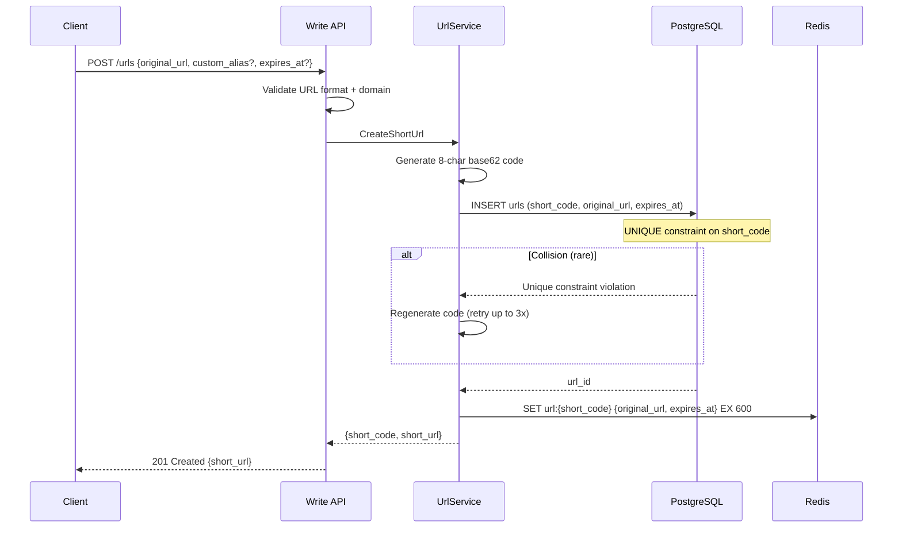
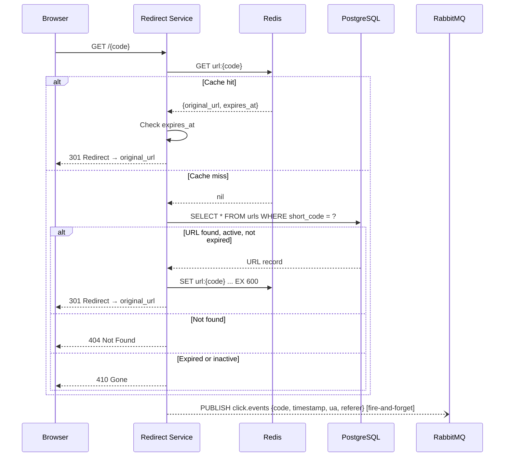

# Requirements — URL Shortener Service

---

## Functional Requirements

**FR-01** — The system shall accept a long URL and return a unique 8-character short code
that redirects to the original URL.

**FR-02** — The system shall support optional custom aliases of 4–32 characters (a-z, A-Z,
0-9, hyphens), subject to uniqueness and reserved-word validation.

**FR-03** — The system shall redirect any request for a valid, active, non-expired short
code to the original URL using a 301 Moved Permanently response.

**FR-04** — The system shall return 404 Not Found for any short code that does not exist
in the system.

**FR-05** — The system shall return 410 Gone for any short code whose `expires_at` has
passed or whose `is_active` flag is false.

**FR-06** — The system shall support an optional `expires_at` field on URL creation, after
which the short code stops redirecting.

**FR-07** — The system shall allow a URL's owner to deactivate a short code (soft delete),
causing it to return 410.

**FR-08** — The system shall record a click event for every successful redirect, capturing
timestamp, user agent, referrer, and country code (derived from IP).

**FR-09** — The API must return click analytics for any URL: total click count, clicks per
day for a configurable date range, and referrer breakdown.

**FR-10** — The system shall generate short codes in a collision-free manner, retrying on
collision up to three times before returning an error.

---

## Non-Functional Requirements

### Availability

- **NFR-01** — The Redirect Service shall maintain 99.9% uptime.
- **NFR-02** — The Write API may have a separate, lower availability SLA (99.5%) — URL
  creation is less critical than redirect resolution.

### Latency

- **NFR-03** — `GET /{code}` (redirect) p99 ≤ 10ms (cache hit), ≤ 50ms (cache miss).
- **NFR-04** — `POST /urls` (create) p99 ≤ 500ms. Acceptable for a write-path operation.
- **NFR-05** — Click event recording must add zero latency to the redirect response.
  Analytics writes are entirely asynchronous.

### Throughput

- **NFR-06** — The system shall sustain 100 million redirects per day (~1,200 req/sec
  sustained, with burst peaks up to 5,000 req/sec for viral links).
- **NFR-07** — Cache hit rate for the redirect path shall exceed 90% under steady-state
  access patterns.

### Durability

- **NFR-08** — A URL that has been successfully created is permanently stored. URL records
  are soft-deleted, never hard-deleted.
- **NFR-09** — Click analytics are best-effort. A click event that cannot be queued due to
  RabbitMQ unavailability is acceptable to lose. Click counts are informational, not financial.

### Consistency

- **NFR-10** — A new URL is available for redirection within 1 second of creation (TTL for
  write-through cache propagation).
- **NFR-11** — A deactivated URL returns 410 within 10 minutes of deactivation (one cache
  TTL window).

---

## Estimated Traffic.

| Metric                      | Estimate                      |
| --------------------------- | ----------------------------- |
| Redirects per day           | 100,000,000                   |
| Redirects per second (avg)  | ~1,160                        |
| Redirects per second (peak) | ~5,000                        |
| URL creations per day       | ~1,000,000 (100:1 read ratio) |
| Click events queued per day | ~100,000,000                  |
| Total stored URLs           | ~500,000,000 (cumulative)     |
| Redis cache working set     | ~10,000,000 hot URLs (~2GB)   |
| Cache TTL                   | 10 minutes (standard)         |

---

## Data Flow

### Write Path — URL Creation



### Read Path — Redirect



### Analytics Processing — Async

```mermaid
graph LR
    RS[Redirect Service] -->|fire-and-forget| Q[RabbitMQ: click.events]
    Q -->|consume| AC[Analytics Consumer]
    AC -->|batch insert| DB[PostgreSQL: url_clicks]
    DB --> API2[Analytics API\nGET /urls/{code}/stats]
```
